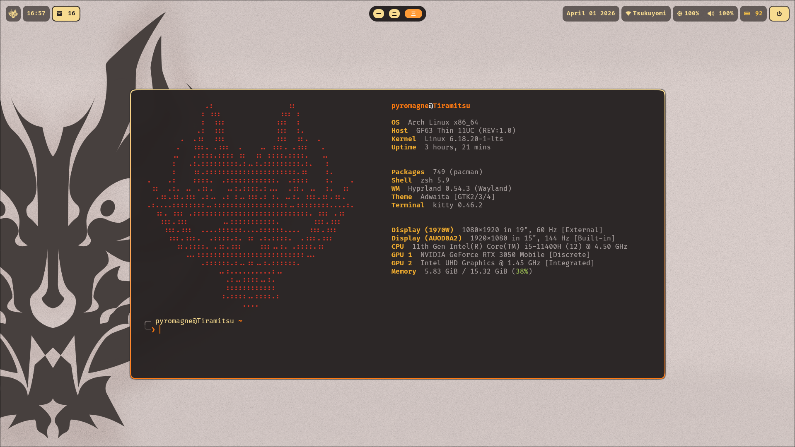
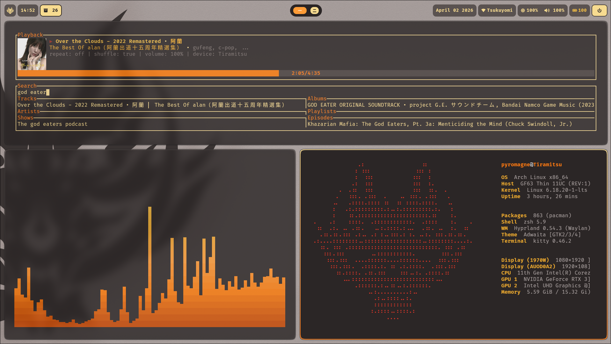

    <h1>God Arch [Hyprland]</h1>

## A God Eater inspired Arch Linux RICE (WIP)

- **WM**: Hyprland
- **Bar**: Waybar
- **Terminal**: Kitty
- **Shell**: zsh
- **App Launcher**: Rofi
- **Notification Daemon**: Mako | Dunst
- **Cursor**: [Future Cursor](https://github.com/yeyushengfan258/Future-cursors)
- **Icon Theme**: Tela Circle Icon Theme

## Dependencies
- hypridle
- hyprland
- hyprlock
- hyprpaper
- hyprshutdown

- pipewire
- slurp
- wl-copy
- jq

- noto-fonts
- noto-fonts-cjk
- noto-fonts-emoji
- ttf-firacode-nerd

## Applications

- libreWolf
- cava
- btop
- htop
- nwg-look
- pacseek
- spotify-player
- swayimg
- vim
- nano
- fastfetch
- Nemo